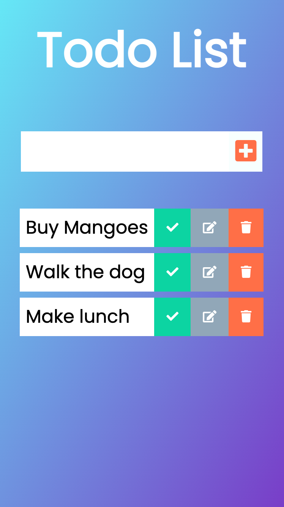

# Todo List React

Functionality
* add item
* delete item
* edit item

This is an assignment from the Odin Project: https://www.theodinproject.com/lessons/node-path-javascript-handle-inputs-and-render-lists